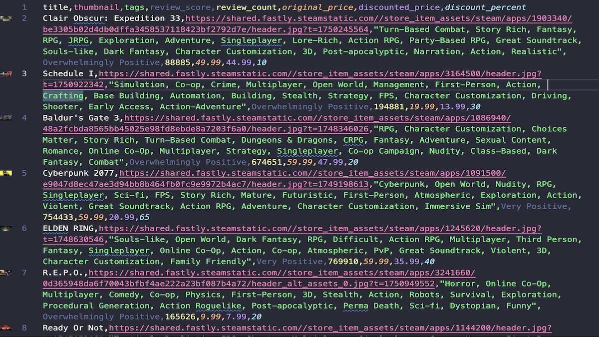

# Steam Specials Scraper

_Playwright-powered scraper for Steam “Specials” — exports clean, analysis-ready CSVs._


A production-style Python scraper that collects deeply discounted games from the Steam Store’s **Specials** page. It renders the page with Playwright, parses content with Selectolax, and saves tidy CSVs you can drop into dashboards or analysis workflows.

---

## 🔍 Key Features

- **JS rendering** with Playwright (Chromium) to handle dynamic content.
- **Structured fields**: `title`, `thumbnail`, `tags`, `review_score`, `review_count`, `original_price`, `discounted_price`, `discount_percent`, plus a scrape timestamp on save.
- **Config-driven scraping** via `config.json` (selectors + attribute mapping).
- **Clean outputs** saved to `output/steam_specials.csv`.

---

## ⚙️ Quick Start

### Prerequisites

- Python **3.10+**
- Git
- Playwright browsers (install step below)

### Install

```bash
# 1) Clone
git clone https://github.com/mdugan8186/steam-specials-scraper.git
cd steam-specials-scraper

# 2) (optional) Virtual environment
python -m venv .venv
# macOS/Linux:
source .venv/bin/activate
# Windows:
.venv\Scripts\activate

# 3) Dependencies
pip install -r requirements.txt

# 4) Install Playwright browsers (first run only)
python -m playwright install chromium
```

### Run

```bash
python main.py
```

- Runs **headed** by default (a visible browser window) as configured in `render.py`.  
  To run headless by default, change `p.chromium.launch(headless=False)` → `headless=True`.

---

## 📁 Output

- CSV is written to: `output/steam_specials.csv`
- Columns include:

```
title, thumbnail, tags, review_score, review_count,
original_price, discounted_price, discount_percent
```

- Tags are saved as a comma-separated string.

---

## 🧩 Configuration

All selectors & attribute mappings live in `config.json`:

```json
{
  "item_selector": "div._1_P15GG6AKyF_NMX2j4-Mu",
  "fields": {
    "title": "div.StoreSaleWidgetTitle",
    "thumbnail": "div.CapsuleImageCtn img",
    "tags": "a.WidgetTag",
    "review_score": "div._3ZWs0kB-1tuqQtie9KK-E7 > div:nth-child(1)",
    "review_count": "div._3ZWs0kB-1tuqQtie9KK-E7 > div:nth-child(2)",
    "original_price": "div._3fFFsvII7Y2KXNLDk_krOW",
    "discounted_price": "div._3j4dI1yA7cRfCvK8h406OB",
    "discount_percent": "div.cnkoFkzVCby40gJ0jGGS4"
  },
  "attributes": {
    "thumbnail": "src",
    "tags": "text",
    "title": "text",
    "review_score": "text",
    "review_count": "text",
    "original_price": "text",
    "discounted_price": "text",
    "discount_percent": "text"
  }
}
```

If Steam updates its markup, adjust these selectors (no Python code changes needed for minor tweaks).

---

## 🧪 Testing & Dev Notes

This repo includes simple test scripts you can run manually:

- **Render test** (`test_render.py`) — renders the page and writes HTML to `output/test_rendered_page.html`.
- **Extract test** (`test_extract.py`) — parses the saved HTML with `config.json` and prints the first items.
- **Transform test** (`test_transform.py`) — runs parsing helpers and prints cleaned items.

> Run sequence:

```bash
python test_render.py
python test_extract.py
python test_transform.py
```

You can also inspect `output/test_rendered_page.html` to update selectors when Steam’s layout changes.

---

## 🛠️ Tech Stack

- **Playwright (Python)** for rendering
- **Selectolax** for fast HTML parsing
- **CSV** outputs for easy analysis

---

## 🎥 Demo

Here’s an example of the scraper output:



The full CSV file is available at: [`output/steam_specials.csv`](output/steam_specials.csv)

---

## ⚖️ Legal & Ethical Use

This scraper is intended for **educational and demonstration purposes only**.  
Steam’s platform and content are subject to their Terms of Service. Please review and comply with their policies before using this project beyond small-scale testing or portfolio demonstration.

---

## 📄 License

This project is licensed under the **MIT License**. See [`LICENSE`](./LICENSE).

---

## 👤 About

**Mike Dugan** — Python Web Scraper & Automation Developer

- **GitHub:** [@mdugan8186](https://github.com/mdugan8186)
- **Portfolio Website:** [scraping-portfolio](https://mdugan8186.github.io/scraping-portfolio/)
- **Fiverr:** [Hire me for web scraping and custom scrapers](https://www.fiverr.com/mdugan8186)
- **Email:** [mdugan8186.work@gmail.com](mailto:mdugan8186.work@gmail.com)
